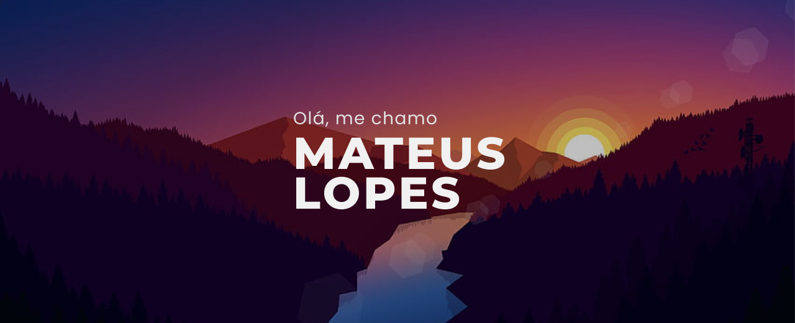

Desenvolvedor Front-end e Designer UI/UX apaixonado por tecnologia e apreciador do universo fisiculturista!
Utilizo Vue.js e React.js no meu dia a dia para a elaboração de páginas e sistemas web responsivos com integração direta à servidores.  

### Tecnologias que utilizo

  
  
  
  
  
  
  

## Github stats

  
  

          

